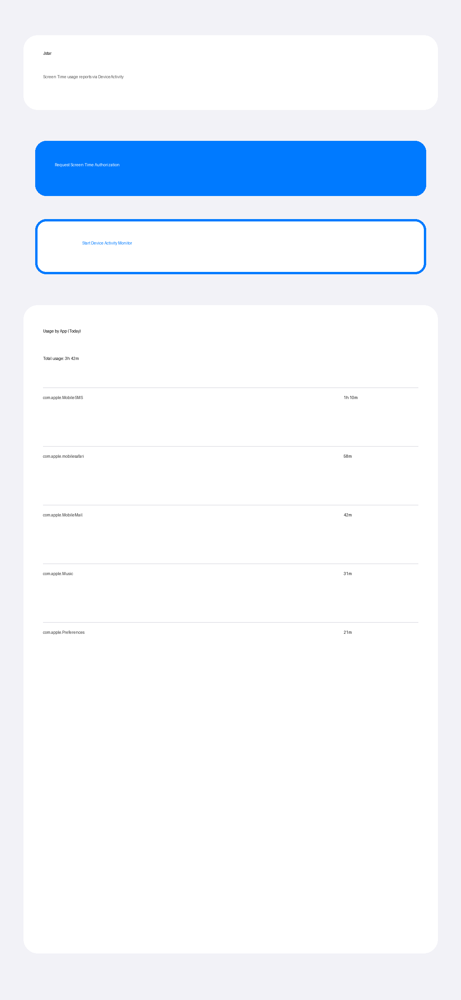

# Jstar (iOS 16+)

Jstar is a minimal SwiftUI Screen Time app that uses Apple Screen Time frameworks:

- `FamilyControls` for authorization
- `DeviceActivity` for monitoring + usage reporting
- A `DeviceActivityReport` extension for per-app usage output

## What this app does

- Requests Screen Time authorization (`AuthorizationCenter`)
- Starts a daily `DeviceActivityCenter` monitor schedule
- Shows a usage report view (`DeviceActivityReport`) for today
- Displays per-app durations from the report extension

> Screen Time data is aggregated by Apple and delivered through reports. This app does **not** provide real-time foreground tracking.

## Project structure

- `/home/runner/work/screentracker/screentracker/Jstar.xcodeproj` — Xcode project
- `/home/runner/work/screentracker/screentracker/Jstar` — main iOS app target
- `/home/runner/work/screentracker/screentracker/JstarReportExtension` — Device Activity report extension target
- `/home/runner/work/screentracker/screentracker/JstarShared` — shared report context constants

## Requirements

- Xcode 15+
- iOS 16+
- Apple Developer account with Screen Time capability enabled for your App ID

## Run instructions

1. Open `/home/runner/work/screentracker/screentracker/Jstar.xcodeproj` in Xcode.
2. Select the **Jstar** app target.
3. Set your Team + unique bundle identifier(s) for:
   - `com.jaswinderrathore101.Jstar`
   - `com.jaswinderrathore101.Jstar.ReportExtension`
4. Ensure both targets keep the `com.apple.developer.family-controls` entitlement.
5. Build and run on a physical iOS device (recommended).

### Permissions / behavior notes

- On first launch, tap **Request Screen Time Authorization** and approve access.
- Tap **Start Device Activity Monitor** to start the daily monitor.
- The report region shows per-app usage from Screen Time report data for the current day.
- The simulator may not provide realistic Screen Time usage data. Use a real device for reliable results.

## Entitlements and configuration included

- `Jstar/Jstar.entitlements`
- `JstarReportExtension/JstarReportExtension.entitlements`
- `JstarReportExtension/Info.plist` includes extension point:
  - `com.apple.deviceactivityui.report-extension`

## UI screenshot

